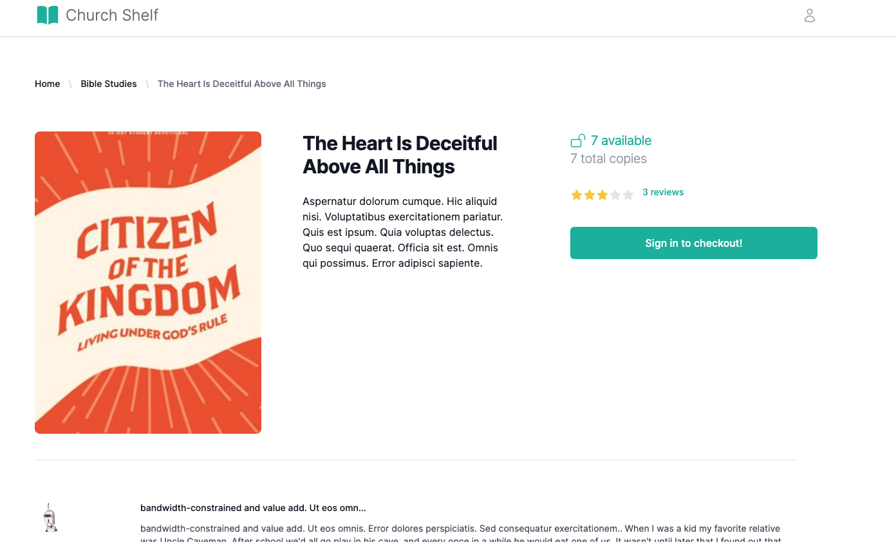

<svg xmlns="http://www.w3.org/2000/svg" viewBox="0 0 24 24" fill="#2DD4BF" style="height: 30px; display: inline;">
   <path d="M11.25 4.533A9.707 9.707 0 0 0 6 3a9.735 9.735 0 0 0-3.25.555.75.75 0 0 0-.5.707v14.25a.75.75 0 0 0 1 .707A8.237 8.237 0 0 1 6 18.75c1.995 0 3.823.707 5.25 1.886V4.533ZM12.75 20.636A8.214 8.214 0 0 1 18 18.75c.966 0 1.89.166 2.75.47a.75.75 0 0 0 1-.708V4.262a.75.75 0 0 0-.5-.707A9.735 9.735 0 0 0 18 3a9.707 9.707 0 0 0-5.25 1.533v16.103Z" />
</svg>  <h1 style="display: inline; margin-bottom: 10px;">ChurchShelf</h1>

## Table of Contents

- [Installation](#installation)
- [MVP Features for ChurchShelf](#mvp-features-for-churchshelf)
- [App Screenshots](#app-screenshots)
- [Future Work](#future-work)

# Try It Out 🎉

You can explore the ChurchShelf application live at [church-shelf.onrender.com](https://church-shelf.onrender.com).  
**⛔️ (Unforunately the FREE tier destroys instances and is on-demand. 😥 If it isn't running, give it about 60 seconds to build back and refresh.)**

# Installation 🧑‍💻

#### Ensure you have the following installed on your machine:

- [Ruby](https://www.ruby-lang.org/en/documentation/installation/) (version 3.2.1)
- [Rails](https://guides.rubyonrails.org/getting_started.html#installing-rails) (version 7.x)
- [PostgreSQL](https://www.postgresql.org/download/)
- [Node.js](https://nodejs.org/en/download/)
- [Yarn](https://classic.yarnpkg.com/en/docs/install/)

#### Clone the repository

```
git clone git@github.com:daynewright/church_shelf.git
cd church_shelf
```

#### Install dependencies

```
bundle install
yarn install
```

#### Set up the database

```
rails db:create
rails db:migrate
```

#### Seed the DB

```
rails db:seed
```

#### Run the development server

```
bin/dev
```

# MVP Features for ChurchShelf

1. **User Authentication**:

   - Basic user accounts

2. **Resources**:

   - Resource details (title, author, category, etc.).

3. **Check-Out and Check-In**:

   - Check out resources with due dates.
   - Check-in resources when returned.
   - Track overdue items.

4. **Search and Filter**:

   - Search for resources by title, author, or category.
   - Filter resources based on type (book, video, etc.).

5. **Wishlist**:

   - Users can add resources to a wishlist for future check-out.

6. **User Profile**:

   - Users can view and manage their profile and check-out history.

# App Screenshots 📸





# Future Work 🏗️

### Resource Management with Membership and Roles

### 1. User Membership

- **Church Membership**: A user can belong to one or more churches. Membership is managed through a join table that links users to churches.
- **Ministry Membership**: A user can belong to one or more ministries within a church. This is also managed through a join table linking users to ministries.

### 2. Resource Ownership

- **Church Resources**: Resources are owned by churches. If a resource is associated with a church, it is available to be managed by users who are members of that church.
- **Ministry Resources**: Resources can also be specifically owned by ministries within a church. Users must be members of both the church and the specific ministry to manage these resources.

### 3. Permissions

- **Managing Church Resources**: A user can manage resources owned by a church if they are a member of that church. The system checks the user’s church memberships to grant or deny access.
- **Managing Ministry Resources**: A user can manage resources owned by a ministry if they are a member of both the church and the specific ministry. The system verifies both memberships before allowing access to ministry-specific resources.

## Example Scenarios

1. **User A** is a member of Church X and has access to resources owned by Church X. They will be able to manage those resources as long as they are part of Church X.
2. **User B** is a member of Church X and Ministry Y within Church X. They can manage resources owned by both Church X and Ministry Y. If a resource is specific to Ministry Y, User B can manage it because they are a member of both the church and the ministry.
3. **User C** is a member of Church X but not of any ministries within Church X. They can manage resources owned by Church X, but they cannot manage resources that are specific to any ministries within Church X.

## Implementation Details

### 1. Models

- **Church**: Has many resources, has many ministries, has many users through a join table.
- **Ministry**: Belongs to a church, has many resources, has many users through a join table.
- **User**: Belongs to many churches, belongs to many ministries, can manage resources based on their memberships.
- **Resource**: Belongs to a church, optionally belongs to a ministry.

### 2. Controllers and Views

- Implement logic in your controllers to check if the current user is a member of the church or ministry that owns the resource before allowing them to perform actions.
- Provide appropriate UI feedback to users about which resources they can manage based on their memberships.

### 3. Authorization

- Use role-based authorization or a gem like Pundit to enforce permissions based on user memberships.
